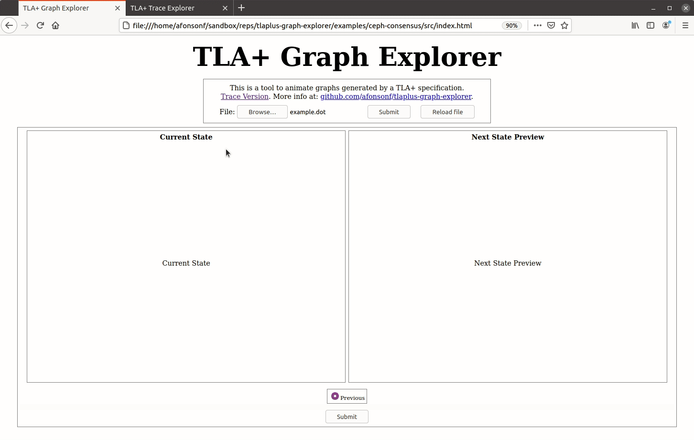
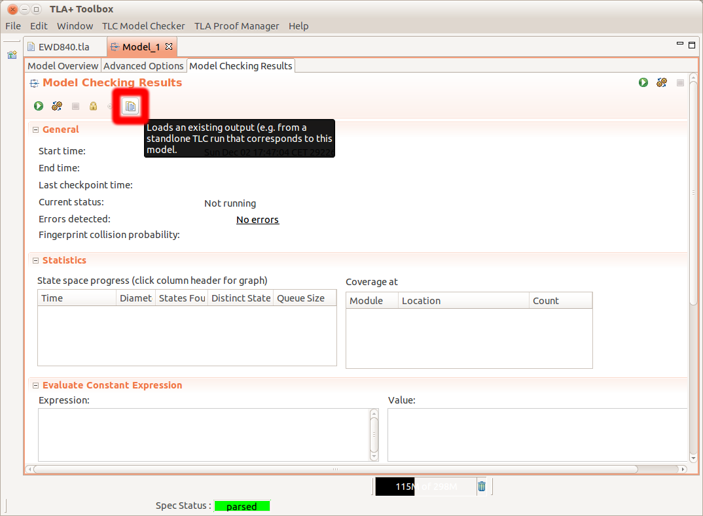

# Graph and trace explorer

This folder has an application that can be used to interactively explore error traces and graphs of the specification model. This application is based in the: https://github.com/afonsonf/tlaplus-graph-explorer.

The example.dot and trace.out can be open in the web application ([explorer/](explorer/)) to interact with the model as shown in the GIF below.

## Opening the trace in the toolbox

The trace is pretty printed in the file: [trace.txt](trace.txt).  
The pretty printed version is obtained using the tlc trace tool with the trace.out file:  
`java -cp tla2tools.jar tlc2.TraceExplorer -prettyPrint trace`

The trace can also be viewed in the toolbox loading the file trace.out (figure below).

(source: https://tla.msr-inria.inria.fr/tlatoolbox/doc/cloudtlc/)
