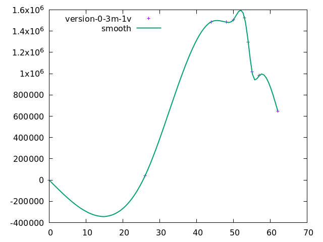
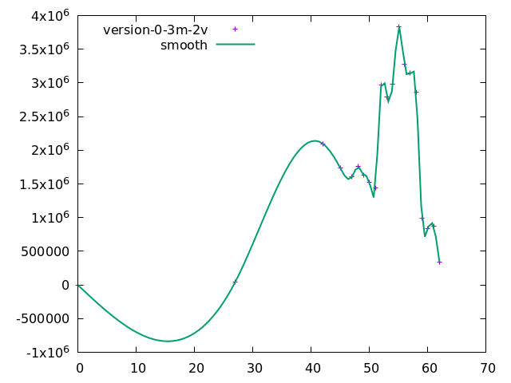
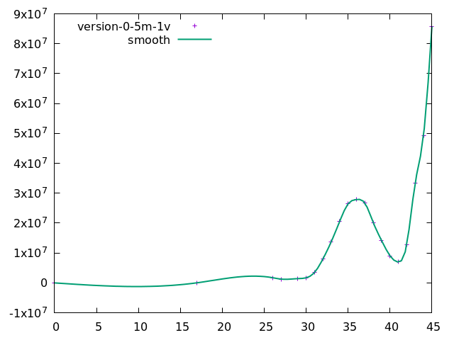

## Some results obtained from the specification model

The results were obtained using an Intel(R) Core(TM) I5 7400 with 4 workers and 7GB allocated to the model checker.

The graphs plot the number of distinct states generated per diameter of the state machine. The values are not exact, they are estimations using the output from the model checker.

With a model with 3 monitors and a value set of size 1:
* Diameter: 62
* Approximated running time: 8min
* Number of distinct states: 9 988 855
* The average outdegree of the complete state graph is 1 (minimum is 0, the maximum 11 and the 95th percentile is 5).

With a model with 3 monitors and a value set of size 2:
* Diameter: 62
* Approximated running time: 28min
* Number of distinct states: 36 729 934
* The average outdegree of the complete state graph is 1 (minimum is 0, the maximum 12 and the 95th percentile is 5).

With a model with 5 monitors and a value set of size 1: (incomplete execution, run out of storage)
* Diameter: 45
* Approximated running time: 5h
* Number of distinct states: 364 707 035

