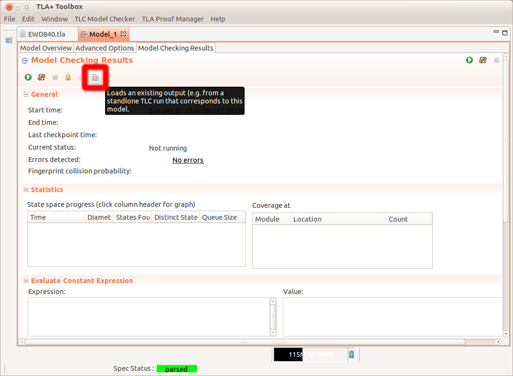

## Trace example of a segment of the algorithm

This folder has na example trace of a run of the algorithm. The trace goes until one monitor has 2 transactions committed (e.g. last_committed[mon] = 2).

The trace is pretty printed in the file: [trace.txt](trace.txt).  
The pretty printed version is obtained using the tlc trace tool with the MC.out file.

The trace can also be viewed in the toolbox loading the file MC.out (figure below).

(source: https://tla.msr-inria.inria.fr/tlatoolbox/doc/cloudtlc/)
